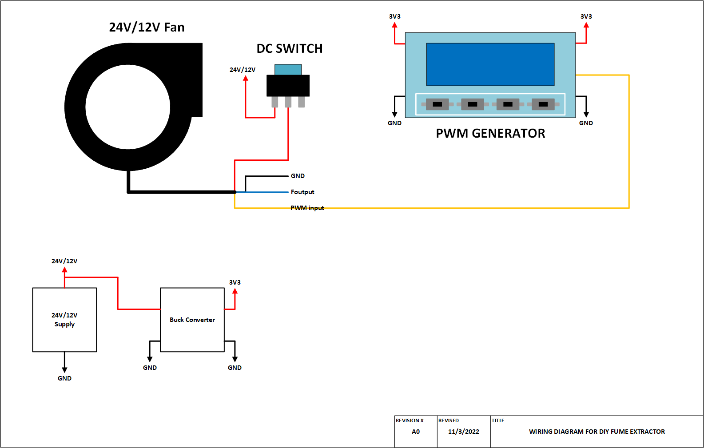
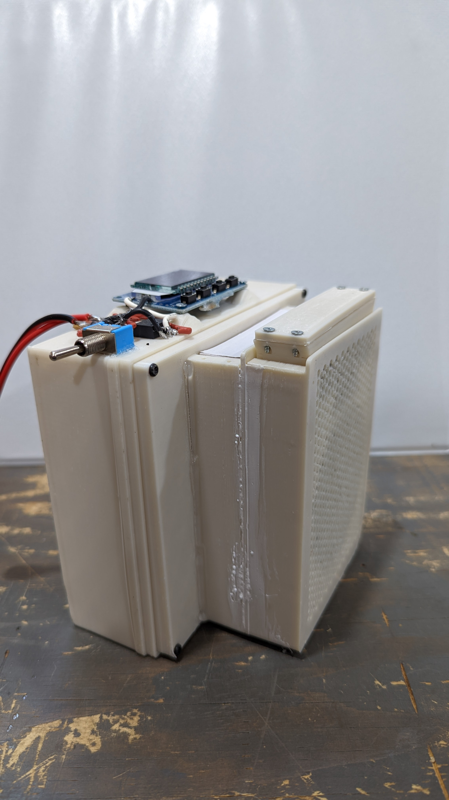
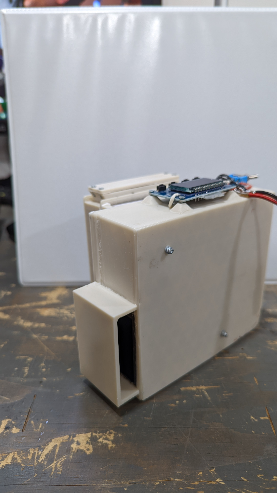
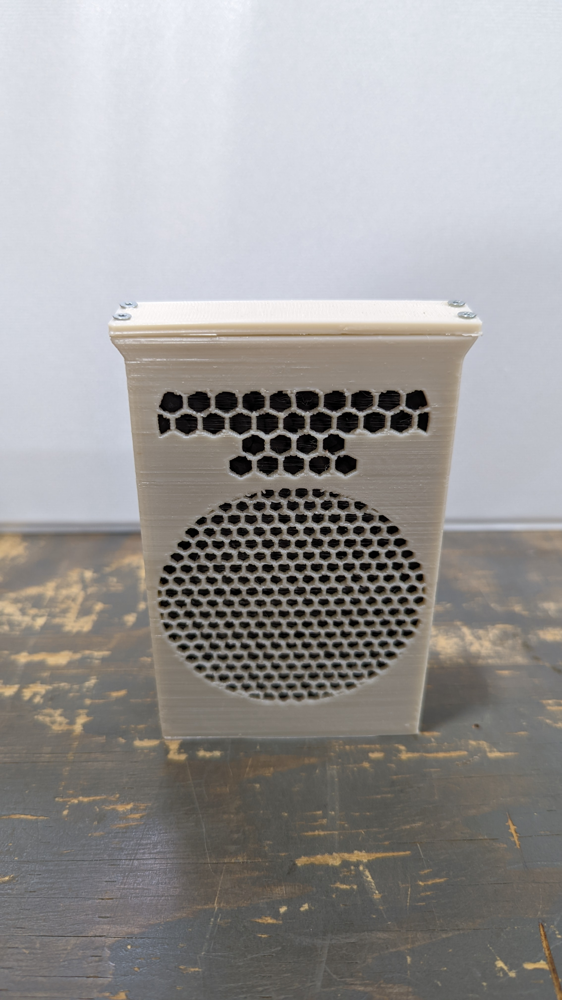
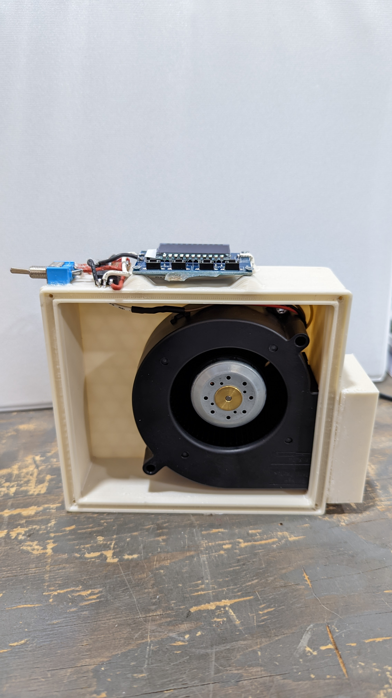
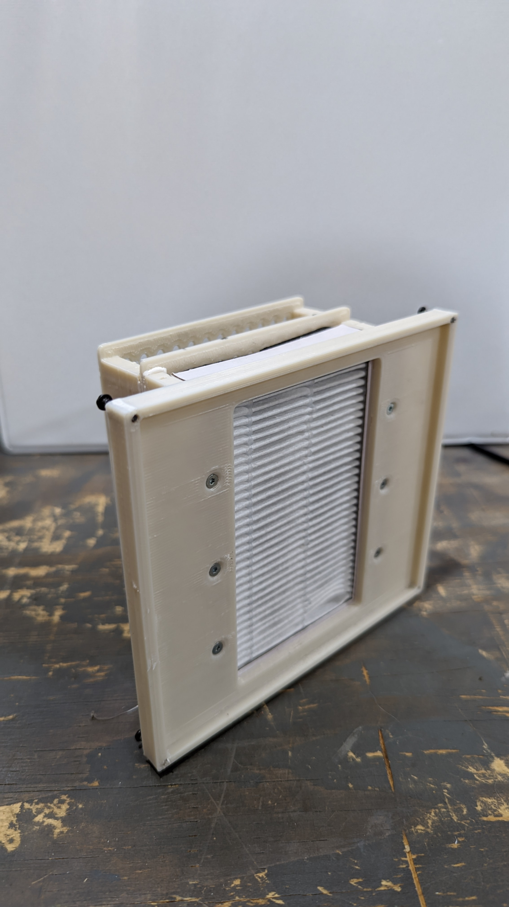

# WARNING!
Just a reminder that this is a DIY product/solution so don’t use this for safety 
critical systems or in any situation where there could be a risk to life. 
There is no warranty, it may not work as expected or at all.

# modular DIY Fume Extractor by simple-ee.com
This project was created to find a low cost alternative to expesive fume extractors 
used when soldering.  When soldering its always good practice to have the fumes
removed from your general area especially when soldering for a prolong period of 
time.  Typical low cost fume extractors are just a 120mm fan with a cheap carbon filter,
and dont get me wrong something is better than nothing but I always like to improve
anything with cost low cost in mind.
## the Table of Contents
1. [Bill of Materials + Link](#thebom)
2. [Wiring Diagram](#thediagram)
3. [Pictures](#thePictures)

## the BOM + Links 
Below is a list of components used in this project.  The fan i used is currently
out of stock but I included alternatives.

Item | Description | Link
-----|-------------|-------
1 | 24V Blower fan with pwm control | https://www.digikey.com/en/products/detail/sanyo-denki-america-inc/9BMB24P2K01/6192098
|||https://www.digikey.com/en/products/detail/delta-electronics/BFB1012EF-0018H/10244640
2 | Activated carbon filter pellets | https://www.fabreeko.com/collections/voron/products/nevermore-carbon?variant=43205733482751
||| https://dfh.fm/products/nevermore-printer-carbon?_pos=6&_sid=682684ab0&_ss=r
3 | PWM Controller | https://www.amazon.com/HiLetgo-Generator-Frequency-Adjustable-1Hz-150Khz/dp/B082F6X8YZ/ref=sr_1_7_sspa?crid=32FR110U4HJLR&keywords=pwm+generator&qid=1667490319&qu=eyJxc2MiOiI0LjYwIiwicXNhIjoiNC4wOCIsInFzcCI6IjMuODMifQ%3D%3D&sprefix=pwm+gene%2Caps%2C142&sr=8-7-spons&psc=1
4 | HEPA Filters | https://www.amazon.com/gp/product/B08J7V1636/ref=ppx_yo_dt_b_search_asin_title?ie=UTF8&th=1
5 | *Buck Converter 24/12V to 3.3V | https://www.amazon.com/MP1584EN-DC-DC-Converter-Adjustable-Module/dp/B01MQGMOKI/ref=sr_1_10?crid=VJ6ST81EXSTT&keywords=buck%2Bconverter&qid=1667487960&qu=eyJxc2MiOiI1LjczIiwicXNhIjoiNS4wMCIsInFzcCI6IjQuNzIifQ%3D%3D&refinements=p_72%3A1248879011&rnid=1248877011&s=electronics&sprefix=buck%2Bconverte%2Caps%2C138&sr=1-10&th=1
||| * Any buck converter that can take a 24V input and step down to 3.3V
6 | DC Switch | https://www.amazon.com/QOFOWIN-Rocker-Toggle-Switch-Marine/dp/B07S8TJ9NG/ref=sr_1_4?crid=UKLZJ53TM04A&keywords=dc+switch+24v&qid=1667490691&qu=eyJxc2MiOiI0LjA0IiwicXNhIjoiMi41OCIsInFzcCI6IjIuMDYifQ%3D%3D&rnid=19346684011&sprefix=switch+dc+2%2Caps%2C128&sr=8-4
7 | #2-28 3/8" screws | https://www.amazon.com/Thread-Rolling-Plastic-Plated-Phillips/dp/B00GDYGBGO/ref=sr_1_3?crid=2FU1QYD8DHH7B&keywords=%232-28+screws&qid=1667491704&qu=eyJxc2MiOiIwLjAwIiwicXNhIjoiMC4wMCIsInFzcCI6IjAuMDAifQ%3D%3D&sprefix=+2-28+screws%2Caps%2C143&sr=8-3

## Pinout and Block Diagram 

## Pictures 
The images I provided is the first version I put together.  The stl/3mf files attached 
are version 2 and should be easier to assemble as the first version was assembled 
with glue vs the second version uses screws.

