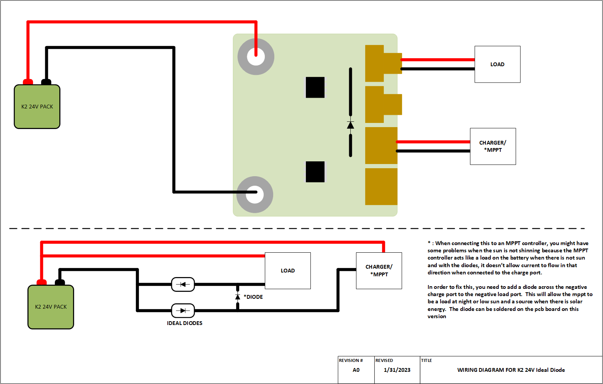
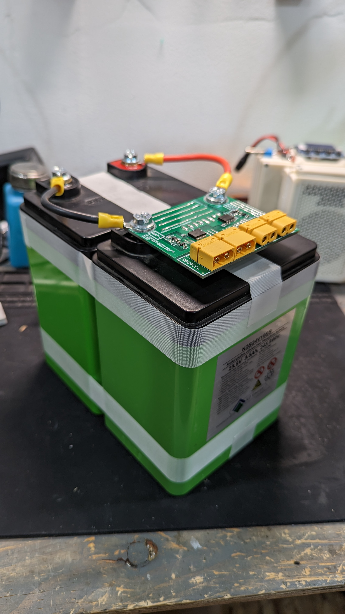
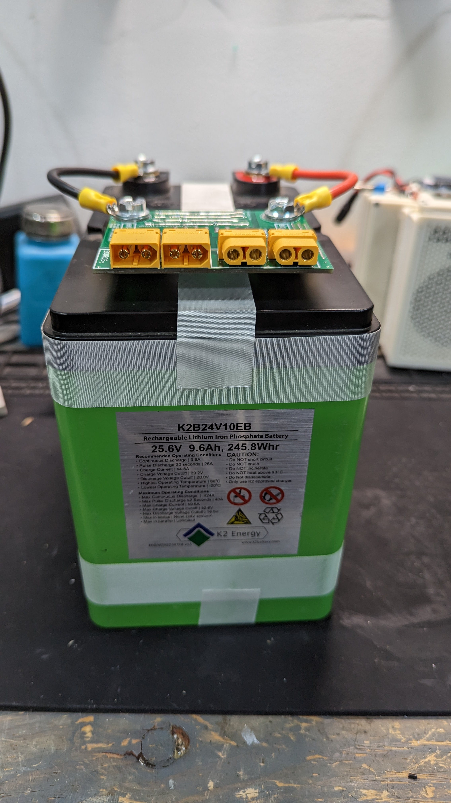
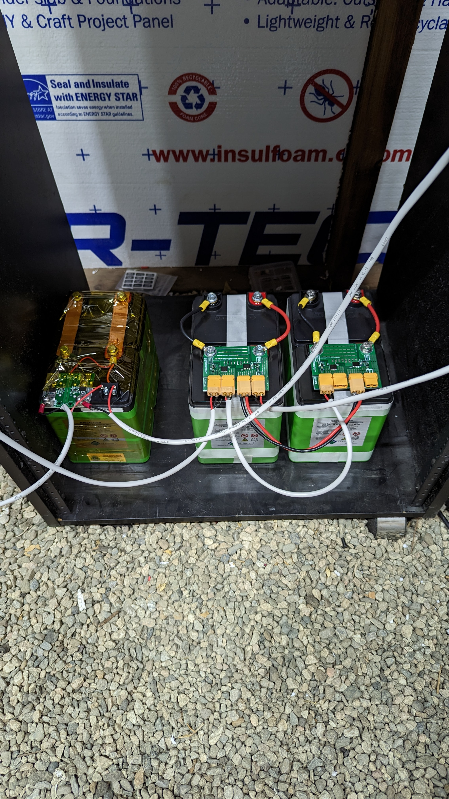

# WARNING!
Just a reminder that this is a DIY product/solution so don’t use this for safety 
critical systems or in any situation where there could be a risk to life. 
There is no warranty, it may not work as expected or at all.

# K2 24V (K2B24V10EB) by simple-ee.com
This project was created so that you can safely parallel as many K2 packs as you
want using the ideal diode approach.  It might seem like its overkill but when 
it comes to batteries and engineering at that, I tend to over design my systems
so that it will outlast my highest expectations.  Since this has a built in BMS
that uses a single port of charge and discharge, I did have to add two Ideal
diodes circuits so you will have a charge and discharge port now.  It might not be 
a problem for some of you but others it might be an inconviences.
## the Table of Contents
1. [Bill of Materials + Link](#thebom)
2. [HTML Bom for assembly](#kibom)
3. [Wiring Diagram](#thediagram)
4. [Pictures](#thePictures)

## the BOM + Links 
Below is the bill of materials.  For the mosfet, it might be out of stock but
you can use any n channel mosfet that uses the LFPAK-88 footprint and is atleast
40V VDS.  I will link a couple of alternatives that work as well as other parts on the 
bom list that are not in stock.

[Bill of Materials](https://github.com/simple-ee/DIY-Projects/tree/main/K2_24V_IdealDiode_Board/Bill%20of%20Materials)

## Pinout and Block Diagram 

## Pictures 
The images I provided is the first version I put together and its been up and running
for about 1 week with todays date stamp of 2023/01/23 without any issues.  

